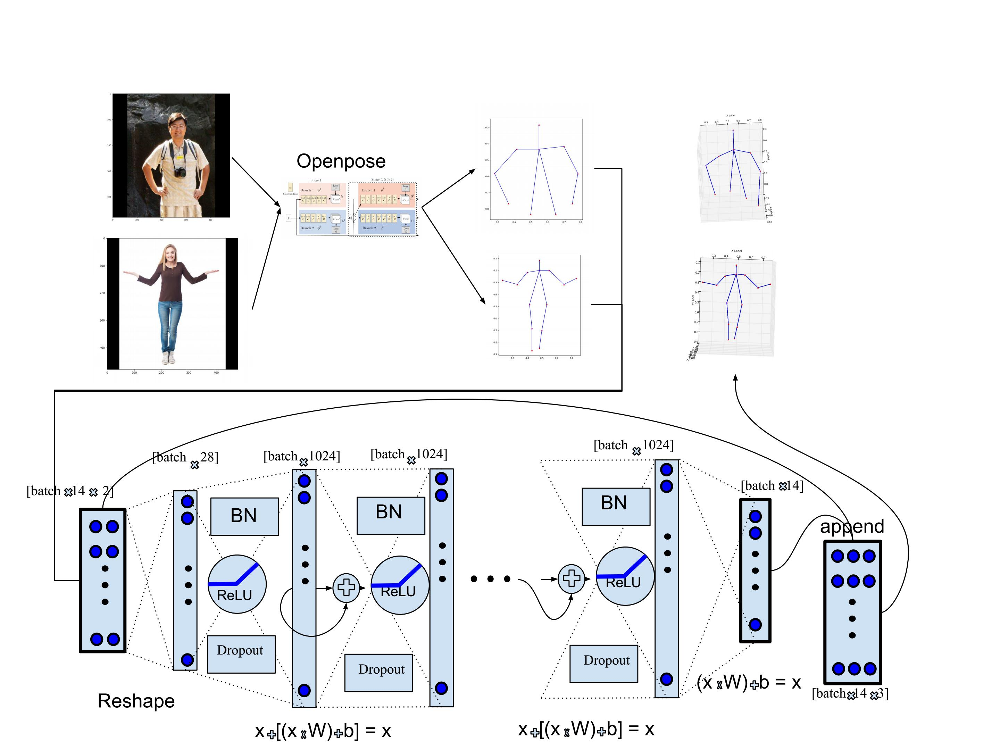
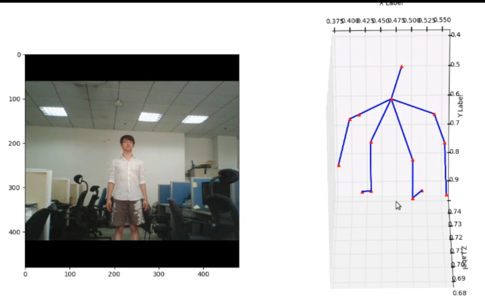

# 3D_openpose
A linear neural network is added to the 2D openpose output. 
This neural network uses the "x" and "y" data axis to estimate the "z" axis. 
The labels are the "z" coordinates extracted from a 3D key points database.

The main file is openpose_3d_2.py
The tensorflow checkpoints are in release section

